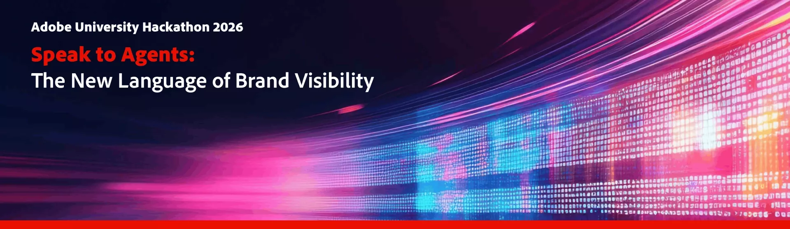

# ✨ Adobe University Hackathon 2026

  

> **Theme:** *Speak to Agents: The New Language of Brand Visibility*

---

# 📖 Overview

Welcome to the **Adobe University Hackathon 2026**.

The way we interact with technology is evolving rapidly. From intelligent assistants to autonomous AI agents, the next generation of digital experiences is being shaped by those who think beyond conventional boundaries.

Adobe University Hackathon 2026 challenges students to design innovative AI-powered solutions that redefine **Brand Visibility** through intelligent agent interactions.

The detailed problem statement will be released during the Development Round.

---

# 🎯 Theme

> **Speak to Agents: The New Language of Brand Visibility**

The hackathon explores how AI agents can transform the way brands communicate, engage, and deliver value to users through intelligent, conversational, and autonomous experiences.

---

# 👥 Eligibility

- Engineering students from all years
- All engineering branches are eligible
- Team size: **2–3 members**
- Cross-year teams are allowed
- Cross-specialization teams are allowed
- Cross-college teams are **not** allowed

---

# 📌 Registration Rules

- Every member must register individually.
- Every member must use their WhatsApp number.
- University Email ID is preferred.
- Gmail can be used if an official ID is unavailable.
- One student can join only **one** team.
- All members must belong to the same institution.

---

# 🏆 Competition Structure

## 📝 Round 1 — Online Assessment

Duration: **90 Minutes**

### Assessment Pattern

| Section | Details |
|----------|----------|
| MCQs | 15 Questions |
| Topics | Algorithms, DSA & Programming Logic |
| Coding | 1 Coding Challenge |
| Case Study | Brand Visibility |
| Attempts | One Attempt Only |

### Important Notes

- Complete the assessment in one sitting.
- Timer cannot be paused.
- Qualification is based on the **team's average score**.

---

## 💻 Round 2 — Development Round

Shortlisted teams will receive:

- Official Problem Statement
- Development Guidelines
- Submission Requirements
- GitHub Repository Instructions
- Documentation Requirements

Deliverables include:

- Source Code
- GitHub Repository
- Supporting Documents

---

## 🚀 Live Launch Session

Shortlisted teams will attend an official Adobe briefing covering:

- Problem Statement Walkthrough
- Expectations
- Evaluation Criteria
- Submission Process
- Interactive Q&A

---

## 🎨 Round 3 — Prototype Showcase

Teams will build a fully functional prototype based on their Round 2 solution.

Expected Deliverables

- Working Prototype
- Interactive User Interface
- Supporting Documentation
- Prototype Submission

Only the Team Leader can submit the prototype.

---

## 🏆 Round 4 — Grand Finale

Finalists will present their solution before Adobe Leadership at:

**Adobe Headquarters, Noida**

Adobe will sponsor:

- Travel
- Accommodation

for all Grand Finale participants.

---

# 🎁 Rewards

## 🥇 First Prize

Each team member receives:

💻 **MacBook Pro**

---

## 🥈 Second Prize

Each team member receives:

💻 **MacBook Neo**

---

## 💼 Top 50 Participants

- Pre-Placement Interview (PPI)
- Internship Opportunity
- ₹1,10,000/month Internship Stipend

---

## 🎉 National Finalists

- Adobe Merchandise
- Sponsored Adobe Office Visit

---

## 📜 Top 50 Teams

Adobe Participation Certificate

---

# ⚠ Important Note

Only students graduating in the **2028 batch** are eligible for:

- Internship Opportunity
- Pre-Placement Interviews (PPIs)

---

# 📅 Official Timeline

| Stage | Duration |
|---------|----------|
| Round 1 | 09 August 2026 |
| Round 2 | 16 Aug – 06 Sep 2026 |
| Live Launch | Adobe Briefing |
| Round 3 | 13 Sep – 27 Sep 2026 |
| Grand Finale | Adobe HQ, Noida |

---

# 📚 Useful Resources

- Official Adobe Website
- Adobe University Hackathon Portal
- GitHub Repository
- Team Notion Workspace
- Google Drive
- Google Meet

---

# 🌟 Motto

> **Think • Build • Innovate • Win**

---
